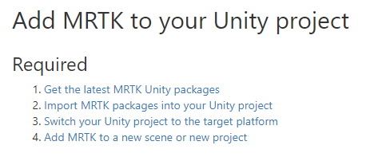

# Vom Erstellungsprozess bis zum Deployment
### Kurzeinführung zum Entwicklungsprozess für Mixed-Reality-Applikationen mit der Microsoft HoloLens

Hinweis: Es wird davon ausgegangen, dass alle notwendigen Tools bereits installiert sind und die Anweisungen in "Getting started with MRTK" durchgeführt worden sind (https://microsoft.github.io/MixedRealityToolkit-Unity/Documentation/GettingStartedWithTheMRTK.html)

## Unity-Einstellungen

### Aktivierung des Mixed-Reality-Supports
Damit die Anwendung Mixed-Reality unterstützen kann, muss manuell der Virtual-Reality-Support aktiviert über die Player-Settings aktiviert werden (Playersettings: Edit->Project Settings)

### Hinzufügen von Fähigkeiten
Wird beispielsweise das Mikrofon, die Webcam oder Internet in der MRTK-Applikation verwendet, müssen vor dem Buildprozess diese ausgewählt werden. Hinweis: Wird erst nachträglich bekannt, dass weitere Fähigkeiten notwendig sind, ist es gegebenenfalls nötig, einen bereits vorhandenen Buildordner zu löschen, da Fähigkeiten nicht automatisch dem aktuellen Buildordner hinzugefügt werden.

### Empfehlung der Qualitätseinstellungen
In vielen Foren wurde empfohlen, den Qualitätslevel auf sehr niedrig einzustellen für eine bessere Performance. Qualitätseinbußen konnten wir dadurch nicht feststellen.

### Änderung des Package-Names
Damit nicht nur eine Applikation auf der HoloLens installiert sein kann, muss der Paketname in Unity angepasst werden. Es reicht nicht aus, nur den Projektnamen im Deploymentprozess zu ändern.

## Buildprozess
(Bild Buildprozess)
## Deployment
Um den Build nun auf die HoloLens zu spielen, beginnt der sogenannte Deployment-Prozess. Dazu muss die die Solutiondatei des Buildprozess geöffnet werden (öffnet sich über Visual Studio) und der Deploymentprozess eingestellt werden (in diesem Fall ist die HoloLens per USB-Kabel angeschlossen)

    
